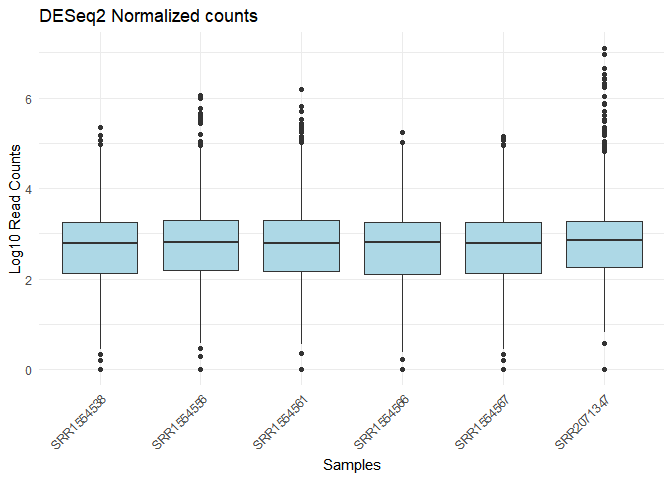

**Coursera Genomic Data Science Capstone Project Report**

This is a Report on the Coursera Genomic Data Science Capstone Project
by Tobi Olanipekun.

The Biological question of interest is to identify which genes are
differentially expressed between Adult and Foetal brain cortex samples.
To answer this, I will carry out Differential gene expression analysis
on RNA seq data obtained from Adult (20-50 years) and Foetal (below 0
years) prefrontal cortex samples as defined and obtained in the 2014
Nature paper (<https://doi.org/10.1038/nn.3898>) "Developmental
regulation of human cortex transcription and its clinical relevance at
base resolution".

**Reads Retrieval and Galaxy Upload.**

I used NCBI's Run selector toolkit and Galaxy for getting and setting up
the raw data. The Bioproject on NCBI's SRA Run selector can be located
with the Bioproject number PRJNA245228. The original had 48 samples
across 6 age groups (including the inteerested Adult and foetal age
groups) from which I randomly selected Samples from 6 adults and 6
foetuses with the following sample run numbers were selected SRR1554537,
SRR1554538, SRR1554541, SRR1554556, SRR1554561, SRR1554566, SRR1554345,
SRR1554568, SRR1554567, SRR1554568, SRR1554345, SRR1554346, SRR1554347,
SRR1554350.

The reads were then uploaded in to the Galaxy platform using the "Faster
Download and Extract Reads in FASTQ format from NCBI SRA (Galaxy Version
3.1.1+galaxy1)". this uploaded in a "collection" containing the 12
samples and each of them has forward and reverse fastq file. (paired end
fastq).

The metadata file containing information for each samples was also
exported into an excel file from SRA runtool kit using the "Metadata"
option after selecting the interested samples. Adult and Featal samples
were identified using the age column and category of Adults as (20-50
years) and (\<0 years) as Foetal.

**Quality Control and Alignment of the raw reads to a reference Genome**

I carried quality control on Galaxy using the FastQC tool (Galaxy
Version 0.74+galaxy1) and after seeing a "good" average quality score of
not less than 36, I mapped the reads to the Human (Homo
sapiens)(b38):hg38 reference genome using Galaxy's HISAT2 tool (Galaxy
Version 2.2.1+galaxy1).

Summary of the average quality score per read (from the FastQC report)
and mapping alignment rate (from the HISAT2 mapping summary) file of
each sample are summarized in an excel sheet and read into R for ease of
further analysis.


``` r
getwd()
```

```
## [1] "C:/Users/olanipe3-INS/Downloads"
```

``` r
setwd("C:/Users/olanipe3-INS/Downloads")

data <- read.table("Manifest with quality score and alignment rate age group excel.txt", header = TRUE, sep = "\t", stringsAsFactors = FALSE)
print(data)
```

```
##           Run mapping_rate_HISAT average_quality_score Age.group
## 1  SRR1554537              99.77                  37.0     fetal
## 2  SRR1554538              99.80                  37.0     fetal
## 3  SRR1554541              99.77                  36.5     fetal
## 4  SRR1554556              99.76                  37.0     adult
## 5  SRR1554561              99.69                  37.0     adult
## 6  SRR1554566              99.79                  37.0     fetal
## 7  SRR1554567              99.78                  37.0     fetal
## 8  SRR1554568              99.78                  37.0     fetal
## 9  SRR2071345              84.79                  37.0     adult
## 10 SRR2071346              80.74                  37.0     adult
## 11 SRR2071347              92.18                  37.0     adult
## 12 SRR2071350              83.63                  37.5     adult
```

There is much variation in the mapping quality rate as it ranges from
(99.80 to 80.74), therefore it is thoughtful to confirm there is no
statistical significance of the mapping quality and average quality
score of the two groups of samples to ensure the reads and alignment
across the groups are not of different quality. I will carry out a
T-test to do this.


``` r
# Subset adult and fetal groups
adult <- subset(data, Age.group == "adult")
fetal <- subset(data, Age.group == "fetal")

# Perform t-test on average quality score
quality_ttest <- t.test(adult$average_quality_score, fetal$average_quality_score)
cat("T-test results for average quality score:\n")
```

```
## T-test results for average quality score:
```

``` r
print(quality_ttest)
```

```
## 
## 	Welch Two Sample t-test
## 
## data:  adult$average_quality_score and fetal$average_quality_score
## t = 1.4142, df = 10, p-value = 0.1877
## alternative hypothesis: true difference in means is not equal to 0
## 95 percent confidence interval:
##  -0.09592202  0.42925535
## sample estimates:
## mean of x mean of y 
##  37.08333  36.91667
```

P-value of 0.1877, no statistical significance of difference


``` r
# Perform t-test for mapping rate
mapping_ttest <- t.test(adult$mapping_rate_HISAT, fetal$mapping_rate_HISAT)
cat("\nT-test results for mapping rate:\n")
```

```
## 
## T-test results for mapping rate:
```

``` r
print(mapping_ttest)
```

```
## 
## 	Welch Two Sample t-test
## 
## data:  adult$mapping_rate_HISAT and fetal$mapping_rate_HISAT
## t = -2.8363, df = 5, p-value = 0.0364
## alternative hypothesis: true difference in means is not equal to 0
## 95 percent confidence interval:
##  -18.3959055  -0.9040945
## sample estimates:
## mean of x mean of y 
##  90.13167  99.78167
```

The p value for the mapping rate is significantly (p-value = 0.0364)
diffferent across the groups and I had limited storage space (glaaxy
offers 250gb storage) to continue working with 12 samples,so I decided
to only keep the top 3 sample reads with the best mapping rates from
each groups


``` r
# Function to keep top N reads with best mapping rates for each group
keep_top_reads <- function(group_data, n = 3) {
  group_data[order(group_data$mapping_rate, decreasing = TRUE)[1:min(n, nrow(group_data))], ]
}

# Apply the function to each age group
top_reads <- do.call(rbind, lapply(split(data, data$Age.group), keep_top_reads))

# Print the resulting dataset
print(top_reads)
```

```
##                 Run mapping_rate_HISAT average_quality_score Age.group
## adult.4  SRR1554556              99.76                    37     adult
## adult.5  SRR1554561              99.69                    37     adult
## adult.11 SRR2071347              92.18                    37     adult
## fetal.2  SRR1554538              99.80                    37     fetal
## fetal.6  SRR1554566              99.79                    37     fetal
## fetal.7  SRR1554567              99.78                    37     fetal
```

Run the T test statistic again


``` r
# Perform t-test for average quality score
#quality_ttest <- t.test(average_quality_score ~ Age.group, data = top_reads)
```

Returns an error message because all the values for the quality score
are the same "37"


``` r
# Perform t-test for mapping rate
mapping_ttest <- t.test(mapping_rate_HISAT ~ Age.group, data = top_reads)

cat("\nT-test results for mapping rate:\n")
```

```
## 
## T-test results for mapping rate:
```

``` r
print(mapping_ttest)
```

```
## 
## 	Welch Two Sample t-test
## 
## data:  mapping_rate_HISAT by Age.group
## t = -1.0258, df = 2, p-value = 0.4128
## alternative hypothesis: true difference in means between group adult and group fetal is not equal to 0
## 95 percent confidence interval:
##  -13.40144   8.24144
## sample estimates:
## mean in group adult mean in group fetal 
##               97.21               99.79
```

"top_reads" now contains the list of reads that I will continue working
with.

I used the gene count feature (featureCounts Galaxy Version
2.0.6+galaxy0) on galaxy to calculate the abundance of every gene in
each of the selected samples, and then merged the resulting output of
each of the samples together to get a gene feature counts file that has
counts of each genes in each of the 6 samples.

Attached Below is a picture of the the entire galaxy workflow


**Data Preprocessing**


``` r
#read in the feature counts file
merged_counts_file <- read.table("Genecounts file 06Dec2024.tabular", header = TRUE, row.names = 1, sep = "\t")

#Here I changed the column names to the names of the respective samples 
colnames(merged_counts_file) = c("SRR1554538","SRR1554556","SRR1554561","SRR1554566","SRR1554567","SRR2071347")
head(merged_counts_file)
```

```
##                    SRR1554538 SRR1554556 SRR1554561 SRR1554566 SRR1554567
## ENSG00000000003.15       1948        329        109       1468       1680
## ENSG00000000005.6           3          0          3          1          3
## ENSG00000000419.14       1528        982        546       1496       1536
## ENSG00000000457.14        970        446        229        973       1042
## ENSG00000000460.17        598        117         34        535        401
## ENSG00000000938.13         71        169        168         74         80
##                    SRR2071347
## ENSG00000000003.15        366
## ENSG00000000005.6           4
## ENSG00000000419.14        301
## ENSG00000000457.14        101
## ENSG00000000460.17         17
## ENSG00000000938.13        179
```

The current gene counts file contains the gene identifier (in ENSEMBLE
Id) in rows, and each sample in the column. SO what I did next is to
convert the ENSEMBL Id to gene names.


``` r
# Load necessary libraries
library(org.Hs.eg.db)
```

```
## Loading required package: AnnotationDbi
```

```
## Loading required package: stats4
```

```
## Loading required package: BiocGenerics
```

```
## 
## Attaching package: 'BiocGenerics'
```

```
## The following objects are masked from 'package:stats':
## 
##     IQR, mad, sd, var, xtabs
```

```
## The following objects are masked from 'package:base':
## 
##     anyDuplicated, aperm, append, as.data.frame, basename, cbind,
##     colnames, dirname, do.call, duplicated, eval, evalq, Filter, Find,
##     get, grep, grepl, intersect, is.unsorted, lapply, Map, mapply,
##     match, mget, order, paste, pmax, pmax.int, pmin, pmin.int,
##     Position, rank, rbind, Reduce, rownames, sapply, setdiff, sort,
##     table, tapply, union, unique, unsplit, which.max, which.min
```

```
## Loading required package: Biobase
```

```
## Welcome to Bioconductor
## 
##     Vignettes contain introductory material; view with
##     'browseVignettes()'. To cite Bioconductor, see
##     'citation("Biobase")', and for packages 'citation("pkgname")'.
```

```
## Loading required package: IRanges
```

```
## Loading required package: S4Vectors
```

```
## 
## Attaching package: 'S4Vectors'
```

```
## The following object is masked from 'package:utils':
## 
##     findMatches
```

```
## The following objects are masked from 'package:base':
## 
##     expand.grid, I, unname
```

```
## 
## Attaching package: 'IRanges'
```

```
## The following object is masked from 'package:grDevices':
## 
##     windows
```

```
## 
```

``` r
library(AnnotationDbi)

# Assuming your gene counts data frame is named 'counts'
# Extract Ensembl IDs from row names and remove version numbers
ensembl_ids <- sub("\\..*", "", sub(".*_", "", rownames(merged_counts_file)))

# Map Ensembl IDs to gene symbols
gene_symbols <- mapIds(org.Hs.eg.db,
                       keys = ensembl_ids,
                       column = "SYMBOL",
                       keytype = "ENSEMBL",
                       multiVals = "first")
```

```
## 'select()' returned 1:many mapping between keys and columns
```

``` r
# Create new row names, using gene symbols where available and original names otherwise
new_rownames <- ifelse(is.na(gene_symbols),
                       sub("_.*", "", rownames(merged_counts_file)),
                       gene_symbols)

# Make the new row names unique
new_rownames <- make.unique(new_rownames)

# Assign the new row names to the counts data frame
rownames(merged_counts_file) <- new_rownames
head(merged_counts_file)
```

```
##        SRR1554538 SRR1554556 SRR1554561 SRR1554566 SRR1554567 SRR2071347
## TSPAN6       1948        329        109       1468       1680        366
## TNMD            3          0          3          1          3          4
## DPM1         1528        982        546       1496       1536        301
## SCYL3         970        446        229        973       1042        101
## FIRRM         598        117         34        535        401         17
## FGR            71        169        168         74         80        179
```

Next, I read in the meta data fine containing the additional
informational of the samples, here I have called into the
"manifest_file" variable


``` r
# Specify the path to your metadata file
manifest_file <- "Full_Manifest_File.tabular"

# Read the manifest file (adjust sep argument as needed)
Full_manifest <- read.table(manifest_file, header = TRUE, sep = "\t", stringsAsFactors = FALSE)

# Print the first few rows of the manifest to verify it has been loaded correctly
head(Full_manifest)
```

```
##          Run mapping_rate_HISAT average_quality_score     AGE
## 1 SRR1554537              99.77                  37.0 -0.3836
## 2 SRR1554538              99.80                  37.0 -0.4027
## 3 SRR1554541              99.77                  36.5 -0.3836
## 4 SRR1554556              99.76                  37.0 36.9800
## 5 SRR1554561              99.69                  37.0 43.8800
## 6 SRR1554566              99.79                  37.0 -0.4986
##   alignment_software..exp. Assay.Type AvgSpotLen       Bases
## 1                  TopHat2    RNA-Seq        182 12199232600
## 2                  TopHat2    RNA-Seq        185 14733333600
## 3                  TopHat2    RNA-Seq        174 16240346600
## 4                  TopHat2    RNA-Seq        184 10789784900
## 5                  TopHat2    RNA-Seq        178  8906186300
## 6                  TopHat2    RNA-Seq        184 11628580200
##   BIOMATERIAL_PROVIDER  BioProject    BioSample BioSampleModel      Bytes
## 1                 LIBD PRJNA245228 SAMN02999520          Human 6485501388
## 2                 LIBD PRJNA245228 SAMN02999521          Human 7505295858
## 3                 LIBD PRJNA245228 SAMN02999524          Human 9002845136
## 4                 LIBD PRJNA245228 SAMN02999539          Human 5539312208
## 5                 LIBD PRJNA245228 SAMN02999544          Human 4426270138
## 6                 LIBD PRJNA245228 SAMN02999549          Human 6256647674
##                              Center.Name Consent DATASTORE.filetype
## 1 LIEBER INSTITUTE FOR BRAIN DEVELOPMENT  public     bam,run.zq,sra
## 2 LIEBER INSTITUTE FOR BRAIN DEVELOPMENT  public     bam,run.zq,sra
## 3 LIEBER INSTITUTE FOR BRAIN DEVELOPMENT  public     bam,run.zq,sra
## 4 LIEBER INSTITUTE FOR BRAIN DEVELOPMENT  public     bam,run.zq,sra
## 5 LIEBER INSTITUTE FOR BRAIN DEVELOPMENT  public     bam,run.zq,sra
## 6 LIEBER INSTITUTE FOR BRAIN DEVELOPMENT  public     bam,run.zq,sra
##   DATASTORE.provider                     DATASTORE.region disease Experiment
## 1         gs,ncbi,s3 gs.us-east1,ncbi.public,s3.us-east-1 control  SRX683795
## 2         gs,ncbi,s3 gs.us-east1,ncbi.public,s3.us-east-1 control  SRX683796
## 3         gs,ncbi,s3 gs.us-east1,ncbi.public,s3.us-east-1 control  SRX683799
## 4         gs,ncbi,s3 gs.us-east1,ncbi.public,s3.us-east-1 control  SRX683814
## 5         gs,ncbi,s3 gs.us-east1,ncbi.public,s3.us-east-1 control  SRX683819
## 6         gs,ncbi,s3 gs.us-east1,ncbi.public,s3.us-east-1 control  SRX683824
##   Fraction          Instrument isolate                   Library.Name
## 1    total Illumina HiSeq 2000   R3452 R3452_DLPFC_polyA_RNAseq_total
## 2    total Illumina HiSeq 2000   R3462 R3462_DLPFC_polyA_RNAseq_total
## 3    total Illumina HiSeq 2000   R3485 R3485_DLPFC_polyA_RNAseq_total
## 4    total Illumina HiSeq 2000   R3969 R3969_DLPFC_polyA_RNAseq_total
## 5    total Illumina HiSeq 2000   R4166 R4166_DLPFC_polyA_RNAseq_total
## 6    total Illumina HiSeq 2000   R4706 R4706_DLPFC_polyA_RNAseq_total
##   LibraryLayout LibrarySelection  LibrarySource     Organism Platform RACE
## 1        PAIRED             cDNA TRANSCRIPTOMIC Homo sapiens ILLUMINA   AA
## 2        PAIRED             cDNA TRANSCRIPTOMIC Homo sapiens ILLUMINA   AA
## 3        PAIRED             cDNA TRANSCRIPTOMIC Homo sapiens ILLUMINA   AA
## 4        PAIRED             cDNA TRANSCRIPTOMIC Homo sapiens ILLUMINA   AA
## 5        PAIRED             cDNA TRANSCRIPTOMIC Homo sapiens ILLUMINA   AA
## 6        PAIRED             cDNA TRANSCRIPTOMIC Homo sapiens ILLUMINA HISP
##            ReleaseDate RIN          create_date version Sample.Name    sex
## 1 2014-11-13T00:00:00Z 9.6 2014-08-21T15:53:00Z       1 R3452_DLPFC female
## 2 2014-11-13T00:00:00Z 6.4 2014-08-21T19:03:00Z       1 R3462_DLPFC female
## 3 2014-11-13T00:00:00Z 5.7 2014-08-21T19:57:00Z       1 R3485_DLPFC   male
## 4 2014-11-13T00:00:00Z 8.5 2014-08-21T18:48:00Z       1 R3969_DLPFC   male
## 5 2014-11-13T00:00:00Z 8.7 2014-08-21T18:06:00Z       1 R4166_DLPFC   male
## 6 2014-11-13T00:00:00Z 8.3 2014-08-21T20:33:00Z       1 R4706_DLPFC   male
##   SRA.Study tissue     AssemblyName dev_stage
## 1 SRP045638  DLPFC GCA_000001405.13        NA
## 2 SRP045638  DLPFC GCA_000001405.13        NA
## 3 SRP045638  DLPFC GCA_000001405.13        NA
## 4 SRP045638  DLPFC GCA_000001405.13        NA
## 5 SRP045638  DLPFC GCA_000001405.13        NA
## 6 SRP045638  DLPFC GCA_000001405.13        NA
```

This Metadata file still has all 12 samples that I initially started
with. so next I subsetted to keep only the current 6 samples I am
working with and which are currently in the column names of the counts
file


``` r
# Load necessary libraries
library(dplyr)
```

```
## 
## Attaching package: 'dplyr'
```

```
## The following object is masked from 'package:AnnotationDbi':
## 
##     select
```

```
## The following objects are masked from 'package:IRanges':
## 
##     collapse, desc, intersect, setdiff, slice, union
```

```
## The following objects are masked from 'package:S4Vectors':
## 
##     first, intersect, rename, setdiff, setequal, union
```

```
## The following object is masked from 'package:Biobase':
## 
##     combine
```

```
## The following objects are masked from 'package:BiocGenerics':
## 
##     combine, intersect, setdiff, union
```

```
## The following objects are masked from 'package:stats':
## 
##     filter, lag
```

```
## The following objects are masked from 'package:base':
## 
##     intersect, setdiff, setequal, union
```

``` r
# Subset the manifest file to include only those samples that are present in the counts data
# Check the column names of the counts data
count_samples <- colnames(merged_counts_file)

# Subset the manifest file to include only those samples that are present in the counts data
subset_manifest <- Full_manifest %>%
  dplyr::filter(Run %in% count_samples)

# Print the first few rows of the subsetted manifest
head(subset_manifest)
```

```
##          Run mapping_rate_HISAT average_quality_score     AGE
## 1 SRR1554538              99.80                    37 -0.4027
## 2 SRR1554556              99.76                    37 36.9800
## 3 SRR1554561              99.69                    37 43.8800
## 4 SRR1554566              99.79                    37 -0.4986
## 5 SRR1554567              99.78                    37 -0.4027
## 6 SRR2071347              92.18                    37 44.1700
##   alignment_software..exp. Assay.Type AvgSpotLen       Bases
## 1                  TopHat2    RNA-Seq        185 14733333600
## 2                  TopHat2    RNA-Seq        184 10789784900
## 3                  TopHat2    RNA-Seq        178  8906186300
## 4                  TopHat2    RNA-Seq        184 11628580200
## 5                  TopHat2    RNA-Seq        183 13631242100
## 6                  TopHat2    RNA-Seq        200  7405130200
##   BIOMATERIAL_PROVIDER  BioProject    BioSample BioSampleModel      Bytes
## 1                 LIBD PRJNA245228 SAMN02999521          Human 7505295858
## 2                 LIBD PRJNA245228 SAMN02999539          Human 5539312208
## 3                 LIBD PRJNA245228 SAMN02999544          Human 4426270138
## 4                 LIBD PRJNA245228 SAMN02999549          Human 6256647674
## 5                 LIBD PRJNA245228 SAMN02999550          Human 7307405938
## 6                 LIBD PRJNA245228 SAMN02999519          Human 5320059078
##                              Center.Name Consent DATASTORE.filetype
## 1 LIEBER INSTITUTE FOR BRAIN DEVELOPMENT  public     bam,run.zq,sra
## 2 LIEBER INSTITUTE FOR BRAIN DEVELOPMENT  public     bam,run.zq,sra
## 3 LIEBER INSTITUTE FOR BRAIN DEVELOPMENT  public     bam,run.zq,sra
## 4 LIEBER INSTITUTE FOR BRAIN DEVELOPMENT  public     bam,run.zq,sra
## 5 LIEBER INSTITUTE FOR BRAIN DEVELOPMENT  public     bam,run.zq,sra
## 6 LIEBER INSTITUTE FOR BRAIN DEVELOPMENT  public   fastq,run.zq,sra
##   DATASTORE.provider                     DATASTORE.region disease Experiment
## 1         gs,ncbi,s3 gs.us-east1,ncbi.public,s3.us-east-1 control  SRX683796
## 2         gs,ncbi,s3 gs.us-east1,ncbi.public,s3.us-east-1 control  SRX683814
## 3         gs,ncbi,s3 gs.us-east1,ncbi.public,s3.us-east-1 control  SRX683819
## 4         gs,ncbi,s3 gs.us-east1,ncbi.public,s3.us-east-1 control  SRX683824
## 5         gs,ncbi,s3 gs.us-east1,ncbi.public,s3.us-east-1 control  SRX683825
## 6         gs,ncbi,s3 gs.us-east1,ncbi.public,s3.us-east-1 control  SRX683794
##   Fraction          Instrument isolate                   Library.Name
## 1    total Illumina HiSeq 2000   R3462 R3462_DLPFC_polyA_RNAseq_total
## 2    total Illumina HiSeq 2000   R3969 R3969_DLPFC_polyA_RNAseq_total
## 3    total Illumina HiSeq 2000   R4166 R4166_DLPFC_polyA_RNAseq_total
## 4    total Illumina HiSeq 2000   R4706 R4706_DLPFC_polyA_RNAseq_total
## 5    total Illumina HiSeq 2000   R4707 R4707_DLPFC_polyA_RNAseq_total
## 6    total Illumina HiSeq 2000   R3098 R3098_DLPFC_polyA_RNAseq_total
##   LibraryLayout LibrarySelection  LibrarySource     Organism Platform RACE
## 1        PAIRED             cDNA TRANSCRIPTOMIC Homo sapiens ILLUMINA   AA
## 2        PAIRED             cDNA TRANSCRIPTOMIC Homo sapiens ILLUMINA   AA
## 3        PAIRED             cDNA TRANSCRIPTOMIC Homo sapiens ILLUMINA   AA
## 4        PAIRED             cDNA TRANSCRIPTOMIC Homo sapiens ILLUMINA HISP
## 5        PAIRED             cDNA TRANSCRIPTOMIC Homo sapiens ILLUMINA   AA
## 6        PAIRED             cDNA TRANSCRIPTOMIC Homo sapiens ILLUMINA   AA
##            ReleaseDate RIN          create_date version Sample.Name    sex
## 1 2014-11-13T00:00:00Z 6.4 2014-08-21T19:03:00Z       1 R3462_DLPFC female
## 2 2014-11-13T00:00:00Z 8.5 2014-08-21T18:48:00Z       1 R3969_DLPFC   male
## 3 2014-11-13T00:00:00Z 8.7 2014-08-21T18:06:00Z       1 R4166_DLPFC   male
## 4 2014-11-13T00:00:00Z 8.3 2014-08-21T20:33:00Z       1 R4706_DLPFC   male
## 5 2014-11-13T00:00:00Z 8.6 2014-08-21T21:22:00Z       1 R4707_DLPFC   male
## 6 2015-06-22T00:00:00Z 5.3 2015-06-22T18:09:00Z       1 R3098_DLPFC female
##   SRA.Study tissue     AssemblyName dev_stage
## 1 SRP045638  DLPFC GCA_000001405.13        NA
## 2 SRP045638  DLPFC GCA_000001405.13        NA
## 3 SRP045638  DLPFC GCA_000001405.13        NA
## 4 SRP045638  DLPFC GCA_000001405.13        NA
## 5 SRP045638  DLPFC GCA_000001405.13        NA
## 6 SRP045638  DLPFC                0        NA
```

Then I renamed for more consistency in variable calling.


``` r
manifest <- subset_manifest
counts<- merged_counts_file
```

Since, the original manifest file has no column for "Age_group", I added
An additional column for that. based on the age of each sample


``` r
manifest$Age_group <- ifelse(manifest$AGE < 0, "Fetal",
                               ifelse(manifest$AGE > 30, "Adult", NA))
# Print the first few rows of the updated manifest to verify
head(manifest) #you may need to scroll to see it
```

```
##          Run mapping_rate_HISAT average_quality_score     AGE
## 1 SRR1554538              99.80                    37 -0.4027
## 2 SRR1554556              99.76                    37 36.9800
## 3 SRR1554561              99.69                    37 43.8800
## 4 SRR1554566              99.79                    37 -0.4986
## 5 SRR1554567              99.78                    37 -0.4027
## 6 SRR2071347              92.18                    37 44.1700
##   alignment_software..exp. Assay.Type AvgSpotLen       Bases
## 1                  TopHat2    RNA-Seq        185 14733333600
## 2                  TopHat2    RNA-Seq        184 10789784900
## 3                  TopHat2    RNA-Seq        178  8906186300
## 4                  TopHat2    RNA-Seq        184 11628580200
## 5                  TopHat2    RNA-Seq        183 13631242100
## 6                  TopHat2    RNA-Seq        200  7405130200
##   BIOMATERIAL_PROVIDER  BioProject    BioSample BioSampleModel      Bytes
## 1                 LIBD PRJNA245228 SAMN02999521          Human 7505295858
## 2                 LIBD PRJNA245228 SAMN02999539          Human 5539312208
## 3                 LIBD PRJNA245228 SAMN02999544          Human 4426270138
## 4                 LIBD PRJNA245228 SAMN02999549          Human 6256647674
## 5                 LIBD PRJNA245228 SAMN02999550          Human 7307405938
## 6                 LIBD PRJNA245228 SAMN02999519          Human 5320059078
##                              Center.Name Consent DATASTORE.filetype
## 1 LIEBER INSTITUTE FOR BRAIN DEVELOPMENT  public     bam,run.zq,sra
## 2 LIEBER INSTITUTE FOR BRAIN DEVELOPMENT  public     bam,run.zq,sra
## 3 LIEBER INSTITUTE FOR BRAIN DEVELOPMENT  public     bam,run.zq,sra
## 4 LIEBER INSTITUTE FOR BRAIN DEVELOPMENT  public     bam,run.zq,sra
## 5 LIEBER INSTITUTE FOR BRAIN DEVELOPMENT  public     bam,run.zq,sra
## 6 LIEBER INSTITUTE FOR BRAIN DEVELOPMENT  public   fastq,run.zq,sra
##   DATASTORE.provider                     DATASTORE.region disease Experiment
## 1         gs,ncbi,s3 gs.us-east1,ncbi.public,s3.us-east-1 control  SRX683796
## 2         gs,ncbi,s3 gs.us-east1,ncbi.public,s3.us-east-1 control  SRX683814
## 3         gs,ncbi,s3 gs.us-east1,ncbi.public,s3.us-east-1 control  SRX683819
## 4         gs,ncbi,s3 gs.us-east1,ncbi.public,s3.us-east-1 control  SRX683824
## 5         gs,ncbi,s3 gs.us-east1,ncbi.public,s3.us-east-1 control  SRX683825
## 6         gs,ncbi,s3 gs.us-east1,ncbi.public,s3.us-east-1 control  SRX683794
##   Fraction          Instrument isolate                   Library.Name
## 1    total Illumina HiSeq 2000   R3462 R3462_DLPFC_polyA_RNAseq_total
## 2    total Illumina HiSeq 2000   R3969 R3969_DLPFC_polyA_RNAseq_total
## 3    total Illumina HiSeq 2000   R4166 R4166_DLPFC_polyA_RNAseq_total
## 4    total Illumina HiSeq 2000   R4706 R4706_DLPFC_polyA_RNAseq_total
## 5    total Illumina HiSeq 2000   R4707 R4707_DLPFC_polyA_RNAseq_total
## 6    total Illumina HiSeq 2000   R3098 R3098_DLPFC_polyA_RNAseq_total
##   LibraryLayout LibrarySelection  LibrarySource     Organism Platform RACE
## 1        PAIRED             cDNA TRANSCRIPTOMIC Homo sapiens ILLUMINA   AA
## 2        PAIRED             cDNA TRANSCRIPTOMIC Homo sapiens ILLUMINA   AA
## 3        PAIRED             cDNA TRANSCRIPTOMIC Homo sapiens ILLUMINA   AA
## 4        PAIRED             cDNA TRANSCRIPTOMIC Homo sapiens ILLUMINA HISP
## 5        PAIRED             cDNA TRANSCRIPTOMIC Homo sapiens ILLUMINA   AA
## 6        PAIRED             cDNA TRANSCRIPTOMIC Homo sapiens ILLUMINA   AA
##            ReleaseDate RIN          create_date version Sample.Name    sex
## 1 2014-11-13T00:00:00Z 6.4 2014-08-21T19:03:00Z       1 R3462_DLPFC female
## 2 2014-11-13T00:00:00Z 8.5 2014-08-21T18:48:00Z       1 R3969_DLPFC   male
## 3 2014-11-13T00:00:00Z 8.7 2014-08-21T18:06:00Z       1 R4166_DLPFC   male
## 4 2014-11-13T00:00:00Z 8.3 2014-08-21T20:33:00Z       1 R4706_DLPFC   male
## 5 2014-11-13T00:00:00Z 8.6 2014-08-21T21:22:00Z       1 R4707_DLPFC   male
## 6 2015-06-22T00:00:00Z 5.3 2015-06-22T18:09:00Z       1 R3098_DLPFC female
##   SRA.Study tissue     AssemblyName dev_stage Age_group
## 1 SRP045638  DLPFC GCA_000001405.13        NA     Fetal
## 2 SRP045638  DLPFC GCA_000001405.13        NA     Adult
## 3 SRP045638  DLPFC GCA_000001405.13        NA     Adult
## 4 SRP045638  DLPFC GCA_000001405.13        NA     Fetal
## 5 SRP045638  DLPFC GCA_000001405.13        NA     Fetal
## 6 SRP045638  DLPFC                0        NA     Adult
```

Usually, the rownames of manifest file should contain the sample
identifiers and should be the sam eand in the order as it is in the
column names of counts file. So i ensured that next.


``` r
rownames(manifest) <-manifest$Run

#check if the number of columns of counts data matches the number of rows of metadata
all.equal(colnames(counts),rownames(manifest))
```

```
## [1] TRUE
```

Next, I explored the data, to have a feel of the quality of the data
such as checking the distribution of the counts, checking to see if
there are lowly expressed genes, and also to guide normalisation and
further preprocessing steps.

I will start with visualising the distribution of the gene counts across
the samples, to check for uniformity. I will be carrying out a log10=1
transformation to reduce the impact of extreme outliers


``` r
# Load necessary libraries
library(ggplot2)
library(reshape2)

# Convert the counts data into a long format for ggplot2
counts_long <- melt(as.data.frame(counts), variable.name = "Sample", value.name = "Gene_Count")
```

```
## No id variables; using all as measure variables
```

``` r
# Apply log10 transformation to the counts (adding a small constant to avoid log(0))
counts_long$Log10_Count <- log10(counts_long$Gene_Count + 1)  # Adding 1 to avoid log(0)

# Create a boxplot to visualize the distribution of log-transformed counts across samples
ggplot(counts_long, aes(x = Sample, y = Log10_Count)) +
  geom_boxplot(fill = "lightblue") +
  labs(title = "Distribution of Log10 Transformed Gene Counts Across Samples",
       x = "Samples",
       y = "Log10 Gene Counts") +
  theme_minimal() +
  theme(axis.text.x = element_text(angle = 45, hjust = 1))
```

<!-- -->

there are many points above the whiskers which shows many genes are
highly expressed, but the median is close to 0 for showing there are
also a lot of lowly expresed genes. the sample (SRR2071347) seems to be
different from the rest, but we will continue with additional
exploration.

Next, I will visualise lowly expressed genes across each sample, setting
the threshold at a count of 5


``` r
#Visualising the percentage of lowly expressed genes across each sample
# set the threshold for low expression
low_expression_threshold <- 5  # Threshold can be adjusted as needed.

# Calculate the number of lowly expressed genes for each sample
lowly_expressed_counts <- colSums(counts <= low_expression_threshold)

# Calculate the total number of genes for each sample
total_genes <- nrow(counts)

# Calculate the percentage of lowly expressed genes for each sample
percentage_lowly_expressed <- (lowly_expressed_counts / total_genes) * 100

# Convert to a data frame for ggplot
low_expression_df <- data.frame(Sample = names(percentage_lowly_expressed), 
                                Percentage_Lowly_Expressed = percentage_lowly_expressed)

# Create a barplot to visualize the percentage of lowly expressed genes across samples
ggplot(low_expression_df, aes(x = Sample, y = Percentage_Lowly_Expressed)) +
  geom_bar(stat = "identity", fill = "lightblue") +
  labs(title = "Percentage of Lowly Expressed Genes Across Samples",
       x = "Samples",
       y = "Percentage of Lowly Expressed Genes (%)") +
  theme_minimal() +
  theme(axis.text.x = element_text(angle = 45, hjust = 1))
```

<!-- -->

All the samples have a round 60 percent of lowly expressed genes (below
the count fo 5), so we might need to discard lowly expressed genes later
on.

Next, I will look at the expression of each genes across the samples,
from the above we expect to have a lot of them.


``` r
# Count the number of genes detected (non-zero counts) for each sample
genes_detected <- colSums(counts > 5)

# Convert to a data frame for ggplot
genes_detected_df <- data.frame(Sample = names(genes_detected), Genes_Detected = genes_detected)

# Create a barplot to visualize the number of genes detected across samples
ggplot(genes_detected_df, aes(x = Sample, y = Genes_Detected)) +
  geom_bar(stat = "identity", fill = "lightblue") +
  labs(title = "Number of Genes Detected Across Samples",
       x = "Samples",
       y = "Number of Genes Detected") +
  theme_minimal() +
  theme(axis.text.x = element_text(angle = 45, hjust = 1))
```

<!-- -->


``` r
#Visualising the detection rate of genes
# Calculate the detection rate for each gene
detection_rates <- rowSums(counts > 5)  # Percentage of samples where the gene is detected

# Convert to a data frame for ggplot
detection_rates_df <- data.frame(Gene = rownames(counts), Detection_Rate = detection_rates)

# Create a barplot to visualize the detection rates across genes
ggplot(detection_rates_df, aes(x = reorder(Gene, Detection_Rate), y = Detection_Rate)) +
  geom_bar(stat = "identity", fill = "lightblue") +
  labs(title = "Detection Rates Across Genes",
       x = "Genes",
       y = "Detection Rate (%)") +
  theme_minimal() +
  theme(axis.text.x = element_text(angle = 90, hjust = 1)) +
  coord_flip()  # Flip coordinates for better readability
```

<!-- -->

A lot of genes are not being expressed at all, even across all of the
samples. SO next, I will filter out lowly expressed genes by calculating
counts per million (CPM) for each gene and set a threshold of 1 CPM in
at least 50% of my samples. This will help remove genes with
consistently low expression across samples, which often provide little
statistical power for differential expression analysis, while also
reducing the noise in the data


``` r
#Many of the genes are not detected in most of the samples, so I will be discarding samples that are not expressed in atleast 50% of the samples
#To discard genes that are not expressed in atleast 50% of the samples
# Calculate total counts for each sample
total_counts <- colSums(counts)

# Calculate CPM for each gene
cpm <- t(t(counts) / total_counts) * 1e6  # Transpose to divide each count by the total counts and multiply by 1e6

# Define a threshold for CPM below which genes will be discarded
cpm_threshold <- 1  # You can adjust this threshold as needed

# Identify genes that are detected (CPM > threshold) in at least a certain number of samples
min_samples_detected <- 0.5 * ncol(counts)  # At least 50% of samples

# Create a logical vector for genes to keep
genes_to_keep <- rowSums(cpm > cpm_threshold) >= min_samples_detected

# Subset the counts data frame to keep only the genes that meet the criteria
filtered_counts <- counts[genes_to_keep, ]

# Print the number of genes retained and discarded
cat("Number of genes retained:", nrow(filtered_counts), "\n")
```

```
## Number of genes retained: 17016
```

``` r
cat("Number of genes discarded:", nrow(counts) - nrow(filtered_counts), "\n")
```

```
## Number of genes discarded: 50033
```

More than 50,000 genes discarded. Now, I visualize the distribution of
the gene counts again.


``` r
# Convert the filtered counts data into a long format for ggplot2
filtered_counts_long <- melt(as.data.frame(filtered_counts), variable.name = "Sample", value.name = "Gene_Count")
```

```
## No id variables; using all as measure variables
```

``` r
# Apply log10 transformation to the counts (adding a small constant to avoid log(0))
filtered_counts_long$Log10_Count <- log10(filtered_counts_long$Gene_Count + 1)  # Adding 1 to avoid log(0)

# Create a boxplot to visualize the distribution of log-transformed counts across samples
ggplot(filtered_counts_long, aes(x = Sample, y = Log10_Count)) +
  geom_boxplot(fill = "lightblue") +
  labs(title = "Distribution of Log10 Transformed Gene Counts for Kept Genes Across Samples",
       x = "Samples",
       y = "Log10 Gene Counts") +
  theme_minimal() +
  theme(axis.text.x = element_text(angle = 45, hjust = 1))
```

<!-- -->

Now we have a cleaner distribution of gene counts across samples since
genes with very low expression has been filtered out and the data now
focuses more on genes with reliable expression levels, which are
typically more biologically meaningful.

**Normalisation**

The next important step is to carry out Normalisation which can help
cater for some technial differences such as in sequencing depth and
libary size between samples further ensuring a more comparable dataset.
i will do this using the popular DESeq2 package.


``` r
#Load necessary libraries
library(DESeq2)
```

```
## Loading required package: GenomicRanges
```

```
## Loading required package: GenomeInfoDb
```

```
## Loading required package: SummarizedExperiment
```

```
## Loading required package: MatrixGenerics
```

```
## Loading required package: matrixStats
```

```
## 
## Attaching package: 'matrixStats'
```

```
## The following object is masked from 'package:dplyr':
## 
##     count
```

```
## The following objects are masked from 'package:Biobase':
## 
##     anyMissing, rowMedians
```

```
## 
## Attaching package: 'MatrixGenerics'
```

```
## The following objects are masked from 'package:matrixStats':
## 
##     colAlls, colAnyNAs, colAnys, colAvgsPerRowSet, colCollapse,
##     colCounts, colCummaxs, colCummins, colCumprods, colCumsums,
##     colDiffs, colIQRDiffs, colIQRs, colLogSumExps, colMadDiffs,
##     colMads, colMaxs, colMeans2, colMedians, colMins, colOrderStats,
##     colProds, colQuantiles, colRanges, colRanks, colSdDiffs, colSds,
##     colSums2, colTabulates, colVarDiffs, colVars, colWeightedMads,
##     colWeightedMeans, colWeightedMedians, colWeightedSds,
##     colWeightedVars, rowAlls, rowAnyNAs, rowAnys, rowAvgsPerColSet,
##     rowCollapse, rowCounts, rowCummaxs, rowCummins, rowCumprods,
##     rowCumsums, rowDiffs, rowIQRDiffs, rowIQRs, rowLogSumExps,
##     rowMadDiffs, rowMads, rowMaxs, rowMeans2, rowMedians, rowMins,
##     rowOrderStats, rowProds, rowQuantiles, rowRanges, rowRanks,
##     rowSdDiffs, rowSds, rowSums2, rowTabulates, rowVarDiffs, rowVars,
##     rowWeightedMads, rowWeightedMeans, rowWeightedMedians,
##     rowWeightedSds, rowWeightedVars
```

```
## The following object is masked from 'package:Biobase':
## 
##     rowMedians
```

``` r
# Create a DESeqDataSet object using the filtered counts fr
dds <- DESeqDataSetFromMatrix(countData = filtered_counts,
                              colData = manifest,
                              design = ~ Age_group)  # Adjust the design formula as needed
```

```
## Warning in DESeqDataSet(se, design = design, ignoreRank): some variables in
## design formula are characters, converting to factors
```

``` r
# Perform normalization and differential expression analysis
dds <- DESeq(dds)
```

```
## estimating size factors
```

```
## estimating dispersions
```

```
## gene-wise dispersion estimates
```

```
## mean-dispersion relationship
```

```
## final dispersion estimates
```

```
## fitting model and testing
```

``` r
d <- DESeq2::estimateSizeFactors(dds,type="ratio")
cd <- counts(d,normalized=TRUE)
Normalized_counts <- log10(as.matrix(cd)+1)
# Convert the filtered counts data into a long format for ggplot2
Normalized_counts_long <- melt(as.data.frame(Normalized_counts), variable.name = "Sample", value.name = "Gene_Count")
```

```
## No id variables; using all as measure variables
```

``` r
# Create a boxplot 
ggplot(Normalized_counts_long, aes(x = Sample, y = Gene_Count)) +
  geom_boxplot(fill = "lightblue") +
  labs(title = "DESeq2 Normalized counts",
       x = "Samples",
       y = "Log10 Read Counts") +
  theme_minimal() +
  theme(axis.text.x = element_text(angle = 45, hjust = 1))
```

<!-- -->

The boxplots now appear even more consistent across samples compared to
the previous graph (kept genes), with nearly identical medians and
interquartile ranges (IQRs). This indicates that normalization has
effectively removed sample-specific biases, such as differences in
sequencing depth.

**Exploratory Data Analysis**

I will next get an initial view of how well the data are similar to each
other. do the samples separate or cluster well? are there outliers?

I will start by construting a heat map that visualizes the distances
between samples based on the normalized counts that we have gotten from
DESeq2


``` r
# Load required libraries
library(DESeq2)
library(pheatmap)
library(ggplot2)

# Assuming 'dds' is your DESeqDataSet object after normalization
# and 'manifest' is your sample information data frame

# Extract normalized counts
normalized_counts <- counts(dds, normalized=TRUE)

# Calculate sample-to-sample distances
sample_distances <- dist(t(normalized_counts))

# Perform hierarchical clustering
hclust_result <- hclust(sample_distances)

# Create a heatmap of sample distances
pheatmap(as.matrix(sample_distances),
         clustering_distance_rows = sample_distances,
         clustering_distance_cols = sample_distances,
         main = "Sample Distance Heatmap")
```

<!-- -->

The dendrogram at the top and side of the heatmap indicates hierarchical
clustering of the samples and shows that the "SRR2071347" sample is
distinctly separated from the other samples, suggesting that it has a
different expression profile compared to the rest.

We can perform a PCA plot next to confirm the clustering pattern and
assess whether it is an outlier


``` r
# Perform PCA
pca_result <- prcomp(t(normalized_counts))

# Create a data frame for plotting
pca_data <- data.frame(PC1 = pca_result$x[,1],
                       PC2 = pca_result$x[,2],
                       Age_group = manifest$Age_group)

# Plot PCA
ggplot(pca_data, aes(x = PC1, y = PC2, color = Age_group)) +
  geom_point(size = 3) +
  theme_minimal() +
  labs(title = "PCA of Normalized Counts",
       x = paste0("PC1: ", round(summary(pca_result)$importance[2,1] * 100, 1), "% variance"),
       y = paste0("PC2: ", round(summary(pca_result)$importance[2,2] * 100, 1), "% variance"))
```

<!-- -->

One sample seems very different from the rest, an outlier.

I will run the PCA again to identify the sample by ID


``` r
# Load required libraries
library(ggplot2)
library(ggrepel)

# Extract PC scores
pc_scores <- as.data.frame(pca_result$x)

# Add sample information
pc_scores$Sample_ID <- rownames(pc_scores)
pc_scores <- merge(pc_scores, manifest, by.x = "Sample_ID", by.y = "Run")

# Calculate the variance explained by each PC
var_explained <- pca_result$sdev^2 / sum(pca_result$sdev^2) * 100

# Create the PCA plot
ggplot(pc_scores, aes(x = PC1, y = PC2, color = Age_group, label = Sample_ID)) +
  geom_point(size = 3) +
  geom_text_repel(size = 3, show.legend = FALSE) +
  theme_minimal() +
  labs(title = "PCA Plot of Normalized Counts",
       x = paste0("PC1: ", round(var_explained[1], 1), "% variance"),
       y = paste0("PC2: ", round(var_explained[2], 1), "% variance")) +
  scale_color_brewer(palette = "Set1")
```

<!-- -->

This could indicate: A biological difference (e.g., a distinct condition
or treatment). A technical artifact (e.g., batch effect or sequencing
issue). the PC variance is alarming high at 99.5% so, I will check the
manifest incase of any obvious differences


``` r
# Assuming 'manifest' is your data frame containing the metadata

# Select the relevant columns
rin_release_data <- manifest[, c("Run", "RIN", "ReleaseDate","sex",'Age_group')]

# Print the data frame to show RIN and ReleaseDate for each sample
print(rin_release_data)
```

```
##                   Run RIN          ReleaseDate    sex Age_group
## SRR1554538 SRR1554538 6.4 2014-11-13T00:00:00Z female     Fetal
## SRR1554556 SRR1554556 8.5 2014-11-13T00:00:00Z   male     Adult
## SRR1554561 SRR1554561 8.7 2014-11-13T00:00:00Z   male     Adult
## SRR1554566 SRR1554566 8.3 2014-11-13T00:00:00Z   male     Fetal
## SRR1554567 SRR1554567 8.6 2014-11-13T00:00:00Z   male     Fetal
## SRR2071347 SRR2071347 5.3 2015-06-22T00:00:00Z female     Adult
```

sample SRR2071347 seems to have been generated in a different bactch
from the others. In its group, it is also the one with the only one with
the different sex (female), but seems it also has a very lo wRNA quality
I will remove it an dcontinue the analysis without it.

Note: In another instance, the next step could be trying to identify
possible batch effects, and to correct for it.

I will remnove the exclude the sample with the low RNA quality number
and also remove it fromthe manifest file


``` r
#RIN 7-10: Indicates intact RNA, generally suitable for most applications.
#RIN 6: May be acceptable depending on the specific requirements of the experiment.
#RIN below 6: Often indicates degraded RNA and may not yield reliable results in RNA-seq or other sensitive assays.
# Assuming 'counts' is your counts matrix and 'manifest' is your metadata data frame

# Remove sample SRR2071347 from counts data
refiltered_counts <- filtered_counts[, colnames(filtered_counts) != "SRR2071347"] #I am using filterd counts because it is the last variable containing the counts before normalisation so as to avoid over normalisation

# Remove sample SRR2071347 from metadata
refiltered_manifest <- manifest[manifest$Run != "SRR2071347", ]

# Ensure row names of refiltered_manifest match column names of refiltered_counts
rownames(refiltered_manifest) <- refiltered_manifest$Run
```

Now, I will attempt the visualisation without it


``` r
# Create DESeqDataSet object with refiltered data
dds <- DESeqDataSetFromMatrix(countData = refiltered_counts,
                              colData = refiltered_manifest,
                              design = ~ Age_group)
```

```
## Warning in DESeqDataSet(se, design = design, ignoreRank): some variables in
## design formula are characters, converting to factors
```

``` r
# Perform DESeq2 normalization
dds <- DESeq(dds)
```

```
## estimating size factors
```

```
## estimating dispersions
```

```
## gene-wise dispersion estimates
```

```
## mean-dispersion relationship
```

```
## final dispersion estimates
```

```
## fitting model and testing
```

``` r
# Extract normalized counts
normalized_counts <- counts(dds, normalized = TRUE)

# Perform PCA
pca_result <- prcomp(t(normalized_counts))

# Create a data frame with PCA results and sample information
pca_data <- data.frame(
  PC1 = pca_result$x[,1],
  PC2 = pca_result$x[,2],
  Sample = colnames(normalized_counts)
)
pca_data <- merge(pca_data, refiltered_manifest, by.x = "Sample", by.y = "Run")

# Calculate variance explained
var_explained <- pca_result$sdev^2 / sum(pca_result$sdev^2) * 100

# Create PCA plot
library(ggplot2)
ggplot(pca_data, aes(x = PC1, y = PC2, color = Age_group, label = Sample)) +
  geom_point(size = 3) +
  geom_text_repel(size = 3, show.legend = FALSE) +
  theme_minimal() +
  labs(title = "PCA Plot of Normalized Counts (Outlier Removed)",
       x = paste0("PC1: ", round(var_explained[1], 1), "% variance"),
       y = paste0("PC2: ", round(var_explained[2], 1), "% variance")) +
  scale_color_brewer(palette = "Set1")
```

<!-- -->

Though the 2 adult samples are very distant from each other here, the
variance is being explained by 10% compared to the 89.2% variance
explained on the horizontal axis which separates them based on the
biologically important age group. So I will continue with the analysis
with these 5 samples.

Quick check of the heat map of the 5 samples again.


``` r
# clustering
# Calculate sample-to-sample distances
sample_distances <- dist(t(normalized_counts))

# Perform hierarchical clustering
hclust_result <- hclust(sample_distances)

# Create a heatmap of sample distances
pheatmap(as.matrix(sample_distances),
         clustering_distance_rows = sample_distances,
         clustering_distance_cols = sample_distances,
         main = "Sample Distance Heatmap")
```

<!-- -->

The dendogram now shows a 2 major group of 2.

Now, I will move on to the differential gene expression analysis

I will carry this out using DESeq2.since, I am intersted in differential
gene expression due to Age group, I specified the experimental design
using the formula '\~ Age_group', indicating that I want to test for
differences in gene expression between age groups. DESeq2 will use this
model to find differentially expressed genes under the age group by
performing several linear model for each the totality of genes. the
"adult" group will be set as the reference level that is being compared
again.


``` r
# Load required libraries
library(DESeq2)
library(ggplot2)
library(EnhancedVolcano)

# Create DESeqDataSet object
dds <- DESeqDataSetFromMatrix(countData = refiltered_counts, 
                    colData = refiltered_manifest, 
                    design = ~ Age_group)
```

```
## Warning in DESeqDataSet(se, design = design, ignoreRank): some variables in
## design formula are characters, converting to factors
```

``` r
# Run DESeq2
dds <- DESeq(dds)
```

```
## estimating size factors
```

```
## estimating dispersions
```

```
## gene-wise dispersion estimates
```

```
## mean-dispersion relationship
```

```
## final dispersion estimates
```

```
## fitting model and testing
```

``` r
# Get results
res <- results(dds)

# Convert to data frame
res_df <- as.data.frame(res)
res_df$gene <- rownames(res_df)

head(res_df)
```

```
##         baseMean log2FoldChange     lfcSE      stat       pvalue         padj
## TSPAN6  919.7753      2.2243701 0.4205074  5.289729 1.224979e-07 1.015025e-06
## DPM1   1140.0343      0.2200906 0.3006781  0.731981 4.641802e-01 5.708416e-01
## SCYL3   656.8298      0.7950269 0.3264931  2.435050 1.488973e-02 3.411995e-02
## FIRRM   283.5126      2.0467102 0.4986603  4.104418 4.053344e-05 1.909114e-04
## FGR     131.6569     -2.0041767 0.4016499 -4.989860 6.042318e-07 4.366236e-06
## CFH     578.7016      0.9832756 0.4840754  2.031245 4.223019e-02 8.257128e-02
##          gene
## TSPAN6 TSPAN6
## DPM1     DPM1
## SCYL3   SCYL3
## FIRRM   FIRRM
## FGR       FGR
## CFH       CFH
```

The results from the DESeq2 shows the log2Fold change which quantifies
the magnitude of expression change of each gene between the two
Age-group conditions; and also the pvalue and adjuisted p value (padj)
which tells us how statistically signifcant the changes of each gene is.
Since there were soo many linear modelling carried out due to the many
genes that were assessed, we will be continuing with the adjusted
p-value that accounts for the large number of statistical tests
performed and is also more stringent.

Next, I accessed the quality of the differential expression analysis by
running diagnostics such as P-value histogram an QQ plot


``` r
# Checking the adjusted p-value distribution
hist(res_df$padj, breaks = 50, main = "adjusted P-value Distribution", xlab = "P-value")
```

<!-- -->

The Histogram shows a uniform distribution close to 1 for most genes
that are non differentially expressed, and a spike close to 0 for the
significantlly differentially expressed genes. this is as expected and
can be buttressed with a QQ plot which will show a comparison of the
expected behaviour vs the observed behaviour of the genes under a null
hypothesis no differnece.


``` r
# Q-Q plot
qqnorm(res_df$stat)
qqline(res_df$stat, col = "red")
```

<!-- -->

This shows that most of the genes follows the red line and therefore
behave normally and follow the expected null distribution and suggests a
well calibrated model. Some of the genes deviate significantly from the
upper tail, suggesting the presence of a true differential expression.

An MA plot which plots the gene expression change of the genes against
their expression level can also show this.


``` r
# Load required libraries
library(ggplot2)

# Create the MA plot
ma_plot <- ggplot(res_df, aes(x = baseMean, y = log2FoldChange)) +
  geom_point(aes(color = padj < 0.05), alpha = 0.6) +
  scale_x_log10() +
  geom_hline(yintercept = 0, color = "red", linetype = "dashed") +
  labs(x = "Mean of normalized counts", 
       y = "Log2 fold change",
       title = "MA Plot") +
  theme_minimal() +
  scale_color_manual(values = c("black", "blue"),
                     name = "Significantly DE",
                     labels = c("No", "Yes")) +
  theme(legend.position = "bottom")

# Display the plot
print(ma_plot)
```

<!-- -->

The red line at 0 fold change (no change in expression among the 2
groups) has uniform and symmetrical distribution of genes around it. the
plot also highlights the distribution of genes with statistal
significance of adjusted p value below 0.05 as shown by the blue dots.

We can then visualize statistically significant differentially expressed
genes by plotting a volcano plot that shows the magnitude of change and
adjusted p value of each gene.


``` r
# Volcano plot
volcano_plot <- EnhancedVolcano(res_df,
                                lab = res_df$gene,
                                x = 'log2FoldChange',
                                y = 'padj',
                                title = 'Volcano Plot',
                                pCutoff = 0.05,
                                FCcutoff = 1,
                                pointSize = 1.5,
                                labSize = 3.0)

print(volcano_plot)
```

<!-- -->

Next I wil show the amount of upregulated, downregulated and
non-significant gene in fetal brain compared to adult.


``` r
p_threshold <- 0.05  # You can change this to your preferred threshold, e.g., 0.00001

# Count significant up- and down-regulated genes
significant_genes <- res_df %>%
  filter(!is.na(padj)) %>%  # Remove genes with NA adjusted p-values
  mutate(
    significant = padj < p_threshold,
    regulation = case_when(
      significant & log2FoldChange > 0 ~ "Upregulated",
      significant & log2FoldChange < 0 ~ "Downregulated",
      TRUE ~ "Not significant"
    )
  )

# Summarize the counts
gene_counts <- significant_genes %>%
  group_by(regulation) %>%
  summarise(count = n()) %>%
  arrange(desc(count))

# Print the results
print(gene_counts)
```

```
## # A tibble: 3  2
##   regulation      count
##   <chr>           <int>
## 1 Not significant  9060
## 2 Downregulated    4213
## 3 Upregulated      3730
```

``` r
library(ggplot2)

ggplot(gene_counts, aes(x = regulation, y = count, fill = regulation)) +
  geom_bar(stat = "identity") +
  geom_text(aes(label = count), vjust = -0.5) +
  theme_minimal() +
  labs(title = "Differentially Expressed Genes",
       x = "Regulation",
       y = "Count") +
  scale_fill_manual(values = c("Upregulated" = "red", "Downregulated" = "blue", "Not significant" = "gray"))
```

<!-- -->

Lastly, as some form of validation, I will visualize the indivisual
expression of genes that literature has shown to be either important and
more abundant in fetal or adult brain, and see if this analysis can
corrrobate them.

1.  SOX11:

-   Function: Critical transcription factor for brain and neuron
    development.
-   Expression: Higher in fetal brains. SOX11 inhibits dendritic
    morphogenesis during early development and its expression decreases
    rapidly after birth[1][4].

2.  DCX (Doublecortin):

-   Function: DCX is involved in neuronal migration and cortical
    layering during brain development.
-   Expression: Higher in fetal brains, as it's crucial for early
    neurodevelopmental processes.

3.  SLC6A1:

-   Function: Encodes GABA transporter 1 (GAT-1), responsible for GABA
    reuptake in neurons and astrocytes.
-   Expression: Highly expressed in both fetal and adult brains, but its
    function becomes more critical as the brain matures and GABAergic
    signaling develops[2][5].

4.  NRGN (Neurogranin):

-   Function: It is involved in synaptic plasticity and long-term
    potentiation.
-   Expression: Generally higher in adult brains, as it's associated
    with mature synaptic function.

5.  CAMK2A:

-   Function: Calcium/calmodulin-dependent protein kinase II alpha,
    crucial for synaptic plasticity, memory processing, and learning.
-   Expression: Higher in adult brains. It plays a significant role in
    long-term potentiation and memory formation in mature neurons[3][6].

[1] <https://medlineplus.gov/genetics/gene/sox11/> [2]
<https://pubmed.ncbi.nlm.nih.gov/34028503/> [3]
<https://www.frontiersin.org/journals/aging-neuroscience/articles/10.3389/fnagi.2019.00084/full>
[4] <https://pmc.ncbi.nlm.nih.gov/articles/PMC6601844/> [5]
<https://academic.oup.com/braincomms/article/2/2/fcaa170/5922604> [6]
<https://pmc.ncbi.nlm.nih.gov/articles/PMC6616294/>


``` r
# Assuming 'dds' is your DESeqDataSet object

# Extract normalized counts for the genes of interest
genes_of_interest <- c("SOX11", "DCX", "SLC6A1", "NRGN", "CAMK2A")
counts_data <- counts(dds, normalized=TRUE)[genes_of_interest,]

# Convert to long format for plotting
library(reshape2)
counts_long <- melt(counts_data)
colnames(counts_long) <- c("Gene", "Sample", "Normalized_Counts")

# Add age group information
counts_long$Age_group <- refiltered_manifest$Age_group[match(counts_long$Sample, rownames(refiltered_manifest))]

# Create the plot
library(ggplot2)

ggplot(counts_long, aes(x=Age_group, y=Normalized_Counts, fill=Gene)) +
  geom_boxplot() +
  facet_wrap(~Gene, scales="free_y") +
  theme_minimal() +
  theme(axis.text.x = element_text(angle = 45, hjust = 1)) +
  labs(title = "Expression of Key Developmental Genes Across Age Groups",
       x = "Age Group",
       y = "Normalized Counts") +
  scale_fill_brewer(palette = "Set1")
```

<!-- -->

The observed expression is as expected.


``` r
sessionInfo()
```

```
## R version 4.3.3 (2024-02-29 ucrt)
## Platform: x86_64-w64-mingw32/x64 (64-bit)
## Running under: Windows 11 x64 (build 22631)
## 
## Matrix products: default
## 
## 
## locale:
## [1] LC_COLLATE=English_Canada.utf8  LC_CTYPE=English_Canada.utf8   
## [3] LC_MONETARY=English_Canada.utf8 LC_NUMERIC=C                   
## [5] LC_TIME=English_Canada.utf8    
## 
## time zone: America/Chicago
## tzcode source: internal
## 
## attached base packages:
## [1] stats4    stats     graphics  grDevices utils     datasets  methods  
## [8] base     
## 
## other attached packages:
##  [1] EnhancedVolcano_1.20.0      ggrepel_0.9.5              
##  [3] pheatmap_1.0.12             DESeq2_1.42.1              
##  [5] SummarizedExperiment_1.32.0 MatrixGenerics_1.14.0      
##  [7] matrixStats_1.3.0           GenomicRanges_1.54.1       
##  [9] GenomeInfoDb_1.38.8         reshape2_1.4.4             
## [11] ggplot2_3.5.1               dplyr_1.1.4                
## [13] org.Hs.eg.db_3.18.0         AnnotationDbi_1.64.1       
## [15] IRanges_2.36.0              S4Vectors_0.40.2           
## [17] Biobase_2.62.0              BiocGenerics_0.48.1        
## 
## loaded via a namespace (and not attached):
##  [1] tidyselect_1.2.1        farver_2.1.1            blob_1.2.4             
##  [4] Biostrings_2.70.3       bitops_1.0-7            fastmap_1.1.1          
##  [7] RCurl_1.98-1.14         digest_0.6.35           lifecycle_1.0.4        
## [10] KEGGREST_1.42.0         RSQLite_2.3.6           magrittr_2.0.3         
## [13] compiler_4.3.3          rlang_1.1.3             sass_0.4.9             
## [16] tools_4.3.3             utf8_1.2.4              yaml_2.3.8             
## [19] knitr_1.46              S4Arrays_1.2.1          labeling_0.4.3         
## [22] bit_4.0.5               DelayedArray_0.28.0     plyr_1.8.9             
## [25] RColorBrewer_1.1-3      abind_1.4-5             BiocParallel_1.36.0    
## [28] withr_3.0.0             grid_4.3.3              fansi_1.0.6            
## [31] colorspace_2.1-0        scales_1.3.0            cli_3.6.2              
## [34] rmarkdown_2.29          crayon_1.5.2            generics_0.1.3         
## [37] rstudioapi_0.16.0       httr_1.4.7              DBI_1.2.2              
## [40] cachem_1.0.8            stringr_1.5.1           zlibbioc_1.48.2        
## [43] parallel_4.3.3          XVector_0.42.0          vctrs_0.6.5            
## [46] Matrix_1.6-5            jsonlite_1.8.8          bit64_4.0.5            
## [49] locfit_1.5-9.9          jquerylib_0.1.4         glue_1.7.0             
## [52] codetools_0.2-19        stringi_1.8.3           gtable_0.3.5           
## [55] munsell_0.5.1           tibble_3.2.1            pillar_1.9.0           
## [58] htmltools_0.5.8.1       GenomeInfoDbData_1.2.11 R6_2.5.1               
## [61] evaluate_0.23           lattice_0.22-5          highr_0.10             
## [64] png_0.1-8               memoise_2.0.1           bslib_0.7.0            
## [67] Rcpp_1.0.12             SparseArray_1.2.4       xfun_0.49              
## [70] pkgconfig_2.0.3
```
